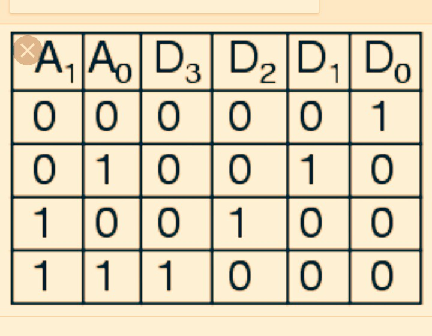
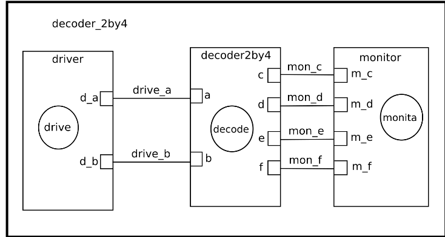

This is a 2-by-4 decoder example, which is a makefile project and so no need for an IDE. 
Just cd into this folder and run the command 

    make decoder

A line decoder is a device that changes the input code into a set of signals. 
It takes an n-digit binary number and decodes it into 2n data lines.
It does the reverse of encoding.  
In the following truth table,D0 is 1 when the input A1 and A0 are both 0, and the outputs D1, D2, D3 are all 0; D1 is 1 when the input A1 is 0 and A0 is 1, and the outputs D0, D2, D3 are all 0; D2 is 1 when the input A1 is 1 and A0 is 0, and the outputs D0, D1, D3 are all 0;D3 is 1 when the input A1 is 1 and A0 is 1, and the outputs D0, D1, D2 are all 0 .It decodes a double digit binary number.
Only one signal is high(selected) when the right binary number is available on the input.  
Its truth table: 

  

###Circuit:

  

Model of computation:

  

Results:
The above MOC was implemented in systemc (code in this folder) and their was no timing diagram. Their was an error in the codeing part.
